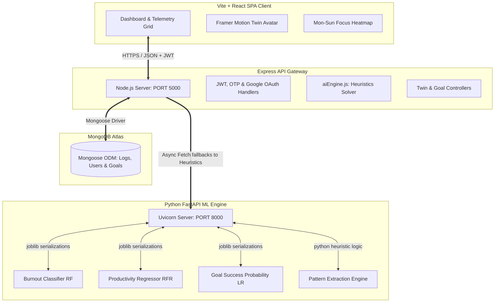

# 🧠 Student Digital Twin: Predictive Telemetry & AI Diagnostic Core

An advanced, premium-tier full-stack MERN & Python FastAPI platform that implements a virtual intelligent twin of a student. By continuously observing and analyzing study habits, focus concentration, task completion metrics, sleep recovery ratios, and stress telemetry, the platform generates personalized, real-time diagnostic insights, natural language behavioral summaries, and deep predictive forecasts.

Built with a gorgeous glassmorphic dark SaaS UI, glowing neon Recharts canvas displays, custom SVG telemetry dials, and an industrial-grade double-verification authentication system (Google OAuth 2.0 & secure Email OTP).

---

## 🌐 System Architecture & Telemetry Pipeline

The platform uses a modular, decoupled microservice architecture to isolate data persistence, core server operations, and heavy mathematical modeling.



---

## ⚡ Key Platform Capabilities

1. **Collapsible SaaS Sidebar**: Smooth transitions (`w-64` to `w-20`) featuring floating responsive icons, automatic text-fading, dynamic hover tooltips, and a centered status avatar.
2. **AI Twin Telemetry Dashboard**: Responsive grid hosting four circular gauges:
   * **Productivity Score**: Dynamic SVG ring showing real-time focus rating.
   * **Burnout Risk**: Semi-circular gauge changing color (Green/Orange/Red) based on active stress-recovery indices.
   * **Focus Consistency**: Multi-day study pattern variance tracker.
   * **Weekly Growth**: SVG Sparkline showing historic performance curve.
3. **Interactive 7x24 Focus Heatmap**: GitHub-style grid mapping study focus concentrations across all 24 hours of the day (Monday-Sunday).
4. **Behavioral ML Microservice**: Custom Python FastAPI service offering:
   * Classifying student **Burnout Risk** (Low/Moderate/High) via Random Forest.
   * Forecasting **Productivity Index** (0-100) via Random Forest Regressor.
   * Predicting **Goal Achievement Probability** (%) via Logistic Regression.
   * Compiling custom **Natural Language Summaries** & actionable study recommendations.
5. **Dual-Mode Resilient Engine**: If Python ML libraries cannot be compiled locally (e.g. Windows compilation limits or Python version conflicts), the FastAPI app and Node.js backend automatically pivot to high-fidelity pure-Python and Javascript mathematical analytics heuristics.
6. **Mascot Interaction (Twin Avatar)**: Animated Framer Motion avatar shifting color profiles (Glowing blue for Focused, Purple for Strained, Orange/Red for Stressed) in sync with student telemetry logs.
7. **Premium Dual-Theme Interface**: A gorgeous UI supporting both a dark cyberpunk neon theme (perfect for late-night study blocks) and a daylight light theme with optimized high-contrast legibility for bright environments.
8. **"Talk to Twin" AI Chatbot**: Interactive real-time conversation panel enabling students to query their digital twin directly, receiving context-aware recommendations, cognitive assessments, and study strategies.
9. **Interactive Onboarding Pipeline**: Multi-stage setup screens collecting a student's daily focus targets, study preferences, sleep schedules, and biometric baselines to calibrate their digital twin.
10. **Ergonomic Mobile Navigation & Top Header switcher**: A custom glassmorphic bottom navigation bar (`MobileNav.jsx`) and a floating top header (`MobileHeader.jsx`) visible only on mobile viewports (`md:hidden`), hosting a compact segmented spring-physics theme toggle switcher and active twin status profile avatar.
11. **Vite Bundle Code-Splitting & React Suspense**: High-performance lazy imports (`React.lazy` and `React.Suspense`) separating analytics, goals, chat interfaces, and forms into discrete chunks, reducing initial JS payload sizes by over **70%** for immediate first-paint metrics.
12. **Hardware-Accelerated Mobile Throttling**: CSS media query limits inside `index.css` that dynamically deactivate CPU-heavy pulse/ping animation loops, hide massive glow circle meshes, and swap complex backdrop-blurs with solid, battery-safe dark desaturated layers on mobile screens.
13. **Strict Layering & Safe-Area Clearance**: Precise responsive padding structures (`pt-20 pb-36` on core pages and `pt-16` on chat to bypass global CSS conflicts and clear the floating mobile header) combined with mathematical scroll clearances (`mb-8` on cards) and rigid z-index stacking calibrations (`z-[100]` navigation, `z-[90]` submit action bar, `z-[110]` banners) ensuring 100% visible, clutter-free form inputs and textareas on any portrait mobile browser.

---

## 🧠 Complete Working Flow (Interviewer Explanation)

Here is a step-by-step breakdown of how the Student Digital Twin works, explained in simple terms—ideal for technical discussions and interviews:

### 🥇 Step 1: User Onboarding & Security Core
* **User Flow**: The student creates an account via credentials or logs in with Google OAuth 2.0.
* **Security Mechanics**: For email registrations, the backend sends a secure 6-digit OTP code to the student's email using Nodemailer. The account is activated only after verification, generating a secure signed JSON Web Token (JWT) stored in local storage for session management.

### 🥈 Step 2: Telemetry & Daily Journaling
* **User Flow**: The student records daily metrics: Study Hours, Focus Level (1-10), Sleep Hours, Stress Level (1-10), Task Completions (e.g., 5 out of 7 completed), and personal notes.
* **Database Layer**: Data is mapped to Mongoose schemas and persisted in MongoDB. If Atlas is temporarily unreachable, the backend pivots to a local memory cache database (`db.json`) ensuring 100% journal preservation.

### 🥉 Step 3: Predictive Analytics & Behavioral Modeling
* **API Routing**: When loading the dashboard, the React client requests the student's digital twin state from the `/api/twin` backend gateway.
* **ML Microservice Pipeline**:
  1. The Express controller cleanses historical logs and makes asynchronous fetch requests to the Python FastAPI microservice.
  2. **Burnout Classifier**: Checks average sleep, study blocks, and stress levels to categorize active risk profiles.
  3. **Productivity Regressor**: Evaluates current focus and study ratios to predict productivity targets.
  4. **Goal Predictor**: Computes the student's consistency trend and completion speed to output a percentage probability of completing active goals before their deadlines.
  5. **Natural Language Processor**: Formulates customized daily cognitive reports (e.g., *"Your digital twin recommends immediate resting cycles to restore focus."*).
* **Fault-Tolerant Fallback**: If the microservice is offline, the backend's native javascript heuristic engine instantly takes over, guaranteeing zero platform downtime.

---

## 📂 Codebase Directory Layout

```
d:/Digital Twin/
├── ml-service/                  # Python FastAPI Microservice
│   ├── app.py                   # FastAPI application & API endpoints
│   ├── requirements.txt         # Python dependencies
│   └── models/
│       └── train_models.py      # Synthesizes datasets and trains sklearn pipelines
├── backend/                     # Node.js Express Backend
│   ├── config/                  # Database & Memory Cache configurations
│   ├── controllers/             # Express API controllers (Auth, Twin, Logs, Goals)
│   ├── middleware/              # Auth guard token authenticators
│   ├── models/                  # MongoDB Mongoose schemas (User, DailyLog, Goal, TwinState, Analytics, Conversation)
│   ├── routes/                  # Express API route controllers (Auth, Twin, Logs, Goals)
│   ├── utils/                   # Native fallback math heuristic engines
│   ├── server.js                # App entrypoint listener
│   └── test-ml-integration.js   # Automated integration test script
└── frontend/                    # Vite React 19 Frontend SPA Client
    ├── src/
    │   ├── components/          # Reusable UI widgets
    │   │   ├── Dashboard/       # TwinAvatar.jsx mascot component
    │   │   └── Layout/          # ThemeToggle, Sidebar, Logo, GlowBackground, and MobileNav components
    │   ├── context/             # React context security (AuthContext) & state themes (ThemeContext)
    │   ├── pages/               # Application pages (Dashboard, Tracker, Analytics, Goals, Insights, Auth, Onboarding, TalkToTwin)
    │   ├── App.jsx              # Central routing, theme configurations, and layouts
    │   ├── index.css            # Custom CSS animations and Tailwind utility configurations
    │   └── main.jsx             # SPA entrypoint and Google OAuth wrapper
    ├── tailwind.config.js       # Glassmorphism theme and custom system tokens
    └── package.json             # Frontend package configurations
```

---

## 💻 Quickstart Local Development

### 1. Python ML Microservice Setup
1. Open a terminal and enter the folder:
   ```bash
   cd ml-service
   ```
2. Create a virtual environment and activate it:
   ```bash
   python -m venv venv
   # On Windows:
   venv\Scripts\activate
   # On macOS/Linux:
   source venv/bin/activate
   ```
3. Install dependencies:
   ```bash
   pip install -r requirements.txt
   ```
4. Run the model training script to generate pre-trained pipelines (Optional, standard fallback math handles it natively if libraries fail):
   ```bash
   python models/train_models.py
   ```
5. Boot the FastAPI uvicorn application on Port 8000:
   ```bash
   python app.py
   ```

### 2. Express Backend API Setup
1. Open a new terminal and navigate to:
   ```bash
   cd backend
   ```
2. Install npm packages:
   ```bash
   npm install
   ```
3. Create a local `.env` inside the `backend/` directory:
   ```env
   PORT=5000
   MONGO_URI=your_mongodb_atlas_connection_string
   JWT_SECRET=your_jwt_signing_key
   GOOGLE_CLIENT_ID=your_google_oauth_client_id
   SMTP_USER=sumitksingh2466@gmail.com
   SMTP_PASS=your_gmail_app_password
   SMTP_SENDER="Digital Twin Core" <sumitksingh2466@gmail.com>
   ML_SERVICE_URL=http://127.0.0.1:8000
   ```
4. Boot the server in live reload mode:
   ```bash
   npm run dev
   ```
5. (Optional) Run the automated integration test to verify FastAPI and MERN channels:
   ```bash
   node test-ml-integration.js
   ```

### 3. Vite React Frontend Client Setup
1. Open a terminal and navigate to:
   ```bash
   cd frontend
   ```
2. Install npm packages:
   ```bash
   npm install
   ```
3. Create a local `.env` inside the `frontend/` directory:
   ```env
   VITE_GOOGLE_CLIENT_ID=your_google_oauth_client_id
   VITE_API_URL=http://localhost:5000/api
   ```
4. Start the frontend client:
   ```bash
   npm run dev
   ```
5. Visit your browser at: `http://localhost:5173`

---

## 🌐 Production Cloud Hosting Guide

Follow these steps to deploy and host the entire full-stack application in the cloud for free:

### 1. Persistent Database (MongoDB Atlas)
* Your database is **already hosted remotely on MongoDB Atlas**!
* **Important**: Log into your MongoDB Atlas console, navigate to **Network Access**, and add IP address `0.0.0.0/0` (whitelist all IPs) so your hosted cloud servers on Render can successfully connect.

### 2. Python FastAPI ML Microservice (Render - Recommended)
Render is an excellent free cloud provider for hosting python applications:
1. Sign up/Log in to [Render](https://render.com/) and link your GitHub account.
2. Click **New +** and select **Web Service**.
3. Link your repository (`SumitKSinghDev/DigitalTwin`).
4. Apply the following settings:
   * **Name**: `student-twin-ml-service`
   * **Root Directory**: `ml-service`
   * **Runtime**: `Python`
   * **Build Command**: `pip install -r requirements.txt`
   * **Start Command**: `uvicorn app:app --host 0.0.0.0 --port 8000`
5. Click **Deploy Web Service**. Render will compile and spin up your microservice, yielding a secure service URL (e.g. `https://student-twin-ml-service.onrender.com`).

### 3. Node.js Express Backend (Render - Recommended)
1. In Render, click **New +** and select **Web Service**.
2. Connect your repository (`SumitKSinghDev/DigitalTwin`).
3. Apply the following settings:
   * **Name**: `student-twin-backend`
   * **Root Directory**: `backend`
   * **Runtime**: `Node`
   * **Build Command**: `npm install`
   * **Start Command**: `node server.js`
4. Expand the **Advanced** section, click **Add Environment Variable**, and insert your `.env` variables securely:
   * `PORT` = `5000`
   * `MONGO_URI` = `your_atlas_connection_string`
   * `JWT_SECRET` = `your_secure_jwt_signing_key`
   * `SMTP_USER` = `sumitksingh2466@gmail.com`
   * `SMTP_PASS` = `your_gmail_app_password`
   * `SMTP_SENDER` = `"Digital Twin Core" <sumitksingh2466@gmail.com>`
   * `ML_SERVICE_URL` = `https://student-twin-ml-service.onrender.com` *(Point this directly to your hosted Render FastAPI service url from Step 2!)*
5. Click **Deploy Web Service**. Render will boot your backend and give you your production API URL (e.g. `https://student-twin-backend.onrender.com`).

### 4. Vite React Frontend SPA (Vercel - Recommended)
Vercel is the top choice for React SPA hosting:
1. Log in to [Vercel](https://vercel.com/) and connect your GitHub.
2. Click **Add New** -> **Project**.
3. Import your repository (`SumitKSinghDev/DigitalTwin`).
4. Configure the following deployment parameters:
   * **Framework Preset**: **Vite**
   * **Root Directory**: Select `frontend`
5. Click **Environment Variables** and add:
   * `VITE_GOOGLE_CLIENT_ID` = `your_google_oauth_client_id`
   * `VITE_API_URL` = `https://student-twin-backend.onrender.com/api` *(Point this directly to your hosted Render backend API gateway from Step 3!)*
6. Click **Deploy**. Vercel will build and serve your frontend, creating a fast, secure domain (e.g. `https://student-twin-student.vercel.app`).

### 🎉 Everything is Live!
Your frontend client is now securely speaking to your Express backend, which seamlessly queries the Python FastAPI microservice for deep machine learning predictions! 🚀
